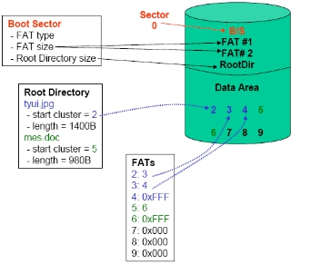
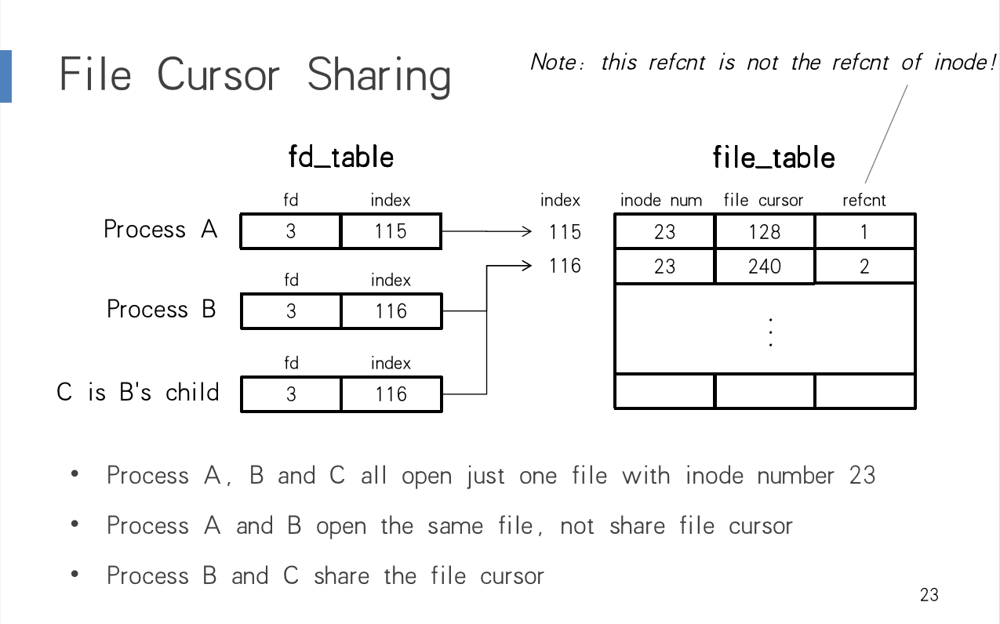
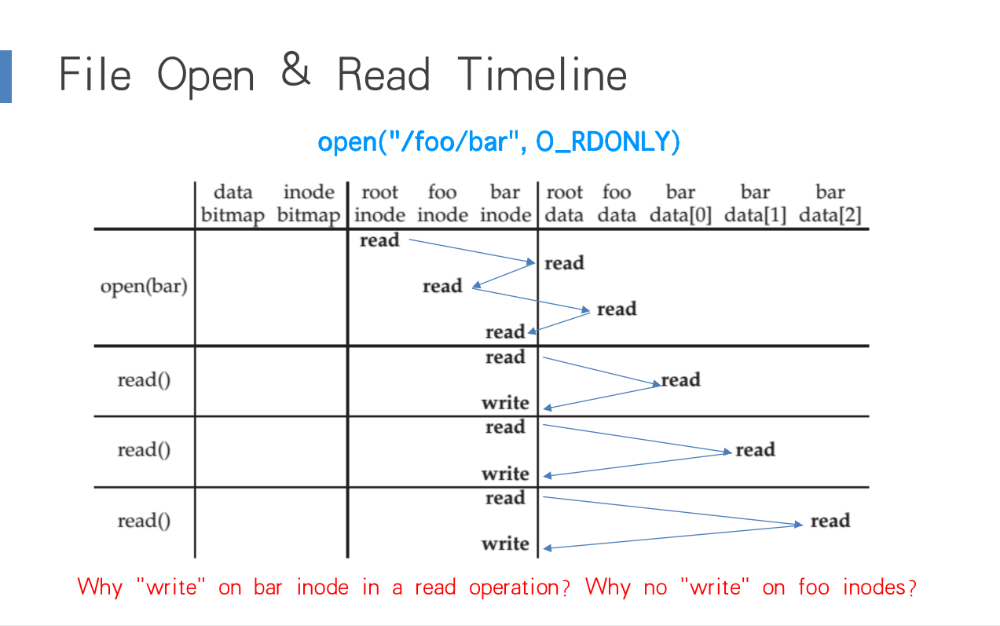

# CSE复习笔记

## File System

### FileSystem Layers

#### Symbolic Link Layer

##### Two types of link(synonyms):

> Add link “assignment” to “mail/new-assignment”
>
> - Hard link:
>   - no new file is created
>   - just add a binding between a string and an ***existing*** inode and the `refcnt` of the inode increased  by 1
>   - if target file is deleted, the link is still valid
> - Soft link
>   - a new file is created, the data is the string “mail/new-assignment”
>   - `refcnt` will not increase
>   - if target file is deleted, the link is invalid


##### context change

`cd soft-link` and `cd .. ` will not change directory to  target file’s upper directory.

#### Absolute path name layer


#### Path Name Layer

#### Link

需要在inode层级上添加refcnt进行计数，当refcnt变为0时，则正式删除文件，即去除掉的inode table中的记录。这个地方的link指hard link。每次unlink就是找到文件名对应的inode，然后通过inodetable找到具体的inode所在磁盘的offset，之后修改refcnt，并在该文件夹中消除该条entry。No Cycle for Link主要是类似于cpp中指针refcnt永远不会是0的情况。

##### renaming-1

1 UNLINK(to_name)

2 LINK(from_name)

3 UNLINK(from_name) 

如果在1、2步中出现fail，等同于是把源文件给删了，但是tmp文件还是在的（这里的语境是Text Edit状态下），应该是可以进行恢复。

##### renaming-2

1 LINK(from_name, to_name)

2 UNLINK(from_name)

如果1和2中间出现fail，则会出现refcnt出现2。

#### File Name Layer

inode中添加一个type，是这一层的需求需要能够区分inode具体的数据的内容是什么，进行的读取的相应操作会不同，比如文件夹就是我进行dump之后直接写入，然后读出来之后进buffer后我会进行反序列化的过程(load/dump)。

#### Inode Number Layer 

inode结构的索引，需要使用数字定位到具体磁盘的定位。存在在磁盘的前部。我们在lab中的实现inode是自增的，但是这样会爆炸，更好的方式是记录一个bitmap for inode number free。根目录的inode number 始终为1。

#### File Layer

##### File Requirements

能存储超过一个block

可能会增长或减小

文件是一个block的数组

需要记录文件的长度

```c++
structure inode {
    integer block_numbers[N];
    integer size;
    integer type;
    integer refcnt;
}
```

一个inode对应多个block


一个inode假设是512Bit，指针是4Bit一个指针的话，能够指向的数据为(126+128+128*128) * 512Bit的数据，使用的组织结构的大小为(1+1+128) * 512 Bit

inode table最普通的是说在磁盘的super block和bitmap for free block的后面的一块区域，可以通过inode number获取到inode在磁盘中的offset，我们也可以使用算法，让这个inode table不是一个中心式的，比如hash到我们的磁盘的各个部分，这样我们可做到inode和具体的数据block更加贴近，能够提升性能(locality)

#### Block Layer

一个block number对应着一块block data，一个block data的大小是一定的。

super block是在磁盘前面的一个部分主要是存储整个disk的一些metadata。

kernel会在FS mount的时候读取superblock

–What will happen if the block size is too small? What if too big?

主要是考虑到如果block size 太小了，会导致block number会很大，为了记录block number都会消耗掉很多的空间，且查询相对更消耗时间，但是资源利用率得到了提高，如果一个block size 过大super block会比较小，但是对于空间的利用率就没有什么保证。

### FAT 



### FileSystem API

#### OPEN & READ

##### open() vs. fopen()


File Metadata is recorded in inode structure:

```c
structure inode {
  ...
  integer atime;
  integer ctime;
  integer mtime;
}
```

- Last access(by READ)
- Last modification(by WRITE)
- Last change of inode(by LINK)

实验证明`cd`并不会调用`LOOKUP`也就不会更改当前目录的`atime`，而`ls`会更改当前目录的`atime`。

##### File Descriptor



##### Timeline




#### WRITE & CLOSE

when writing, which order is preferred?

- Allocate new blocks, write new data, update size.

#### DELETE

Delete after OPEN but before CLOSE

- one process has OPENed a file
- another process removes the last name pointing to the file(refcnt is 0 now)
- the inode is not freed until the first process calls CLOSE

delete即unlink，在文件的上级目录里将文件名和inode number的映射条目删除，因此第二个进程delete后，其他的进程将无法通过OPEN获取此文件的inode number。但是此时这个文件的inode的refcnt已经为0，却没有被文件系统删除。直到第一个进程CLOSE后，这个inode及其data才会被删除。

#### SYNC

buffer cache&disk cache

### FileSystem Design

#### Fast FS

- 用bitmap代替freelist（可以快速查出连续块
- 尽量为文件分配连续空间（减少碎片化
- 保留10%的空间（阻止被迫地碎片存储的情况
- skip sector positioning（减少寻道时间

##### block allocation


##### rotational delay

场景：（CPU controll）读一个块，做处理，再读其后紧跟的块，但同时，磁盘还在继续转动，导致第二次读取块数据时已经错过了块的起始位置。


##### cylinder group


- metadata和对应data的block更集中了，减少了寻道的时间
- metadata分散，可以保证磁盘在物理损耗时还有部分metadata信息保留下来

#### SMR


## Interrupt

#### livelock

When a huge stream of incoming packets each generate an interrupt it is possible for the OS to livelock. The CPU only processes interrupts and never allows a user-level process to run and actually service the requests.

- solution: hybrid

> - Default using interrupts
> - When an interrupt happens, handle it and polling for a while to solve subsequence requests
> - If no further request or time-out, fall back to interrupt again
> - Used in Linux network driver with the name NAPI (New API)

#### interrupt coalescing

a device which needs to raise an interrupt waits for a bit in order to merge multiple interrupts(may come from other devices) inot one, but leading to increasement of latency.

## DMA

 