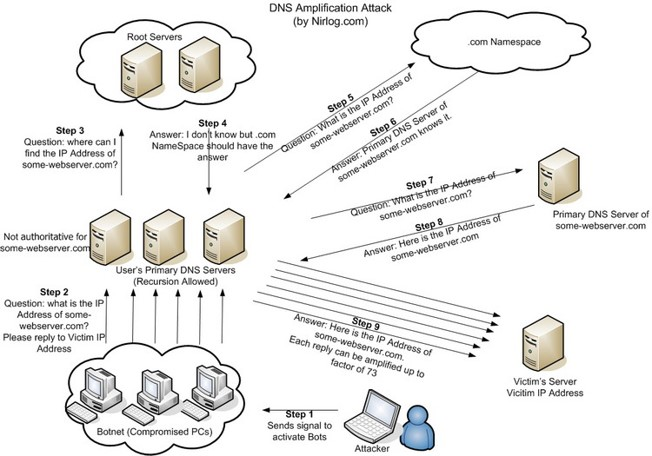
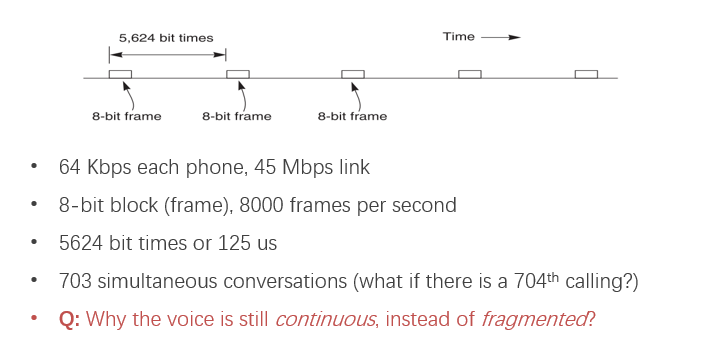

# CSE复习笔记

## File System

### FileSystem Layers

#### Symbolic Link Layer

##### Two types of link(synonyms):


> Add link “assignment” to “mail/new-assignment”
>
> - Hard link:
>   - no new file is created
>   - just add a binding between a string and an ***existing*** inode and the `refcnt` of the inode increased  by 1
>   - if target file is deleted, the link is still valid
> - Soft link
>   - a new file is created, the data is the string “mail/new-assignment”
>   - `refcnt` will not increase
>   - if target file is deleted, the link is invalid


##### context change

`cd soft-link` and `cd .. ` will not change directory to  target file’s upper directory.


如果你是新接入的设备，你将会在内存中农记录一个inode（并不代表你这个设备里面也是inode组织形式的file system）

引入新的问题，如果我们想要在文件系统A里面做一个Link访问文件系统B的一个文件。实现这个功能的背景是：

- Inode is different on other disks
- supports to attach new disks to the name space

我们提出的两个方案：

- make inodes unique all disks
- create synonyms for the files on the other disks

symbolic link的实现方式就是创建一个新的inode类型是link，我们读一个link类型的inode的时候，进行的操作是读取对应block的内容，内容即为我们指向的文件（夹）的absolute path

#### Absolute path name layer


这个inode table是书上这种集中式处理的方式里面的具体数据其实只展示了blocks这个部分，有关inode其他部分的信息只是没有在上图中展示出来。

#### Path Name Layer

#### Link

需要在inode层级上添加refcnt进行计数，当refcnt变为0时，则正式删除文件，即去除掉的inode table中的记录。这个地方的link指hard link。每次unlink就是找到文件名对应的inode，然后通过inodetable找到具体的inode所在磁盘的offset，之后修改refcnt，并在该文件夹中消除该条entry。No Cycle for Link主要是类似于cpp中指针refcnt永远不会是0的情况。

##### renaming-1

1 UNLINK(to_name)

2 LINK(from_name)

3 UNLINK(from_name) 

如果在1、2步中出现fail，等同于是把源文件给删了，但是tmp文件还是在的（这里的语境是Text Edit状态下），应该是可以进行恢复。

##### renaming-2

1 LINK(from_name, to_name)

2 UNLINK(from_name)

如果1和2中间出现fail，则会出现refcnt出现2。

#### File Name Layer

inode中添加一个type，是这一层的需求需要能够区分inode具体的数据的内容是什么，进行的读取的相应操作会不同，比如文件夹就是我进行dump之后直接写入，然后读出来之后进buffer后我会进行反序列化的过程(load/dump)。

#### Inode Number Layer 

inode结构的索引，需要使用数字定位到具体磁盘的定位。存在在磁盘的前部。我们在lab中的实现inode是自增的，但是这样会爆炸，更好的方式是记录一个bitmap for inode number free。根目录的inode number 始终为1。

#### File Layer

##### File Requirements

能存储超过一个block

可能会增长或减小

文件是一个block的数组

需要记录文件的长度

```c++
structure inode {
    integer block_numbers[N];
    integer size;
    integer type;
    integer refcnt;
}
```

一个inode对应多个block


一个inode假设是512Bit，指针是4Bit一个指针的话，能够指向的数据为(126+128+128*128) * 512Bit的数据，使用的组织结构的大小为(1+1+128) * 512 Bit

inode table最普通的是说在磁盘的super block和bitmap for free block的后面的一块区域，可以通过inode number获取到inode在磁盘中的offset，我们也可以使用算法，让这个inode table不是一个中心式的，比如hash到我们的磁盘的各个部分，这样我们可做到inode和具体的数据block更加贴近，能够提升性能(locality)

#### Block Layer

一个block number对应着一块block data，一个block data的大小是一定的。

super block是在磁盘前面的一个部分主要是存储整个disk的一些metadata。

kernel会在FS mount的时候读取superblock

–What will happen if the block size is too small? What if too big?

主要是考虑到如果block size 太小了，会导致block number会很大，为了记录block number都会消耗掉很多的空间，且查询相对更消耗时间，但是资源利用率得到了提高，如果一个block size 过大super block会比较小，但是对于空间的利用率就没有什么保证。

### FAT(File Allocation Table)


**文件分配表：**FAT 文件系统的数据存储单元称为“簇”。簇的标准大小范围： 一个“簇”由一组连续的扇区组成，簇所包含的扇区个数必须是 2 的整数次幂， 如： 1、2、4、8、16、32 或 64 。 “簇” 的最大值为64个扇区，即32kb。

**目录项：** FAT 文件系统内的每个文件和文件夹都被分配一个目录项， 这个目录项中记录了该文件或文件夹的，文件名、大小、创建时间、文件内容起始地址以及其他一些“元数据”，说明对应的文件的“起始簇号”。

如上图所示整体结构中的“FAT 区” 由文件分区所具有的两个“(大小、结构内容相同的)FAT 表”组成，“FAT 区”紧跟在“保留区”之后。“FAT 表” 用以描述 “数据区”中的数据存储单元的分配状态 以及 为文件或目录内容分配的存储单元的前后连接关系。

文件的元信息只包含name&size，并且这些源信息存储在文件夹中，文件夹也是一种文件，文件夹里面有很多的entries，entries可能是文件，文件就包含文件名和大小，也可能是子文件夹，但是size不知道是不是统计量。

FAT不支持soft link和hard link，其上也不支持权限控制，就非常的简单。

### File Descriptor

使用File Descriptor的本因是在于我们要在操作系统通使用system call，比如write read等等，这个时候，我们需要有一个参数作为的连接操作系统和文件系统的桥梁。我们最开始会有两种选择：

- 直接返回操作系统中对应的inode的指针
- 直接返回所有的对应文件的所有block numbers

我们最终创建出File Descriptor这样的一个参数有以下两个原因：

- 安全，用户不会如同一一样能够有机会访问到内核的数据结构。
- 不会穿透让用户 直接操作文件系统，而是所有的文件操作均由操作系统代为处理。

#### FD的使用场景
##### open() vs. fopen()


##### cursor

1. 父子进程可以share cursor，通过父进程向子进程传递fd
2. 两个进程不share file cursor的是通过两个fd指向同一个文件来实现的。

##### fd_table & file_table

整个系统只有一个file_table，每个进程会有一个独立的fd_table，fd_table主要是记录map of fd to index of the file_table。

每一个process 都有自己的fd name space，即fd_table是process的context在进程间切换的时候会被切换点，即如果在进程1中存在把fd=1 重定向到一个文件，切换到另一个继承进行cout，对应的文件并没有输入。


#### 有关于atime mtime ctime的实验

Time stamps

- Last access (by READ)

- Last modification (by WRITE)

- Last change of inode (by LINK)

atime对于ls第一次是可以的，第二次似乎在bash里面是有cache的，是不会再修改的了

### System Call OPEN READ CREATION


**When writing, which order is preferred?**

- Allocate new blocks, write new data, update size

- Allocate new blocks, update size, write new data

- Update size, allocate new blocks, write new data

第一个就是对的，因为如果size先给update了的话，一旦出现断电再恢复，就会发现读取到脏的数据，但是如果先allocate blocks然后断电了就会说只是磁盘自己内部有一块不见了。

##### 有关多进程删除文件

如果一个进程打开了某文件，但是另一个进程删除了该文件，这个时候unlink会删除掉文件夹里面的entry，inode的refcnt变为0，但是现在另一个进程手中的fd是对应的是inode（在file table）。


#### Pooling & Interupt

Polling模式就是 OS 等待device做完操作之后再回到kernel态，这样浪费CPU太多的时间。

Interrupt指 OS提交一个task，在task完成操作之后，device给OS发送一个信号量，OS开始处理相关的数据，这样会存在一个livelock的问题，CPU会经常进行interrupt而不会回到user-level process。

采用混合模式，默认情况下使用interrupt，在interrupt发生后，启用polling，直到timeout或者没有其他请求时切换回interrupt。

#### Interrupt Coalescing for Optimization

这个方面是和上一个优化是相互呼应的，上面的优化是OS层面的，本段的优化是针对device层面的，会存在在准备触发一次Interrupt的情况下，先等待一个指定时间，再打包整个interrupt回去。

#### DMA

Memory和Disk的交互原来需要CPU持续操作，占用CPU时间，现在出现一块硬件，可以让Memory和Disk的交互经过DMA，不需要占用CPU时间。

benefit：

- 减轻CPU load的调用
- 减少一次穿透
- 扩大总线支持long message的优势
- 摊销bus在protocol的overhead

#### Methods of Device Interaction
- PIO 通过in & out的汇编指令让CPU跟device进行交互，只能在kernel mode被调用
- Memroy-mapped I/O，使用LOAD & STORE，可以在用户态被使用，比如mmap的调用

#### 关于memory

出了cpu，所有的东西都是physical memory，我们原有的memory的physical memory被扩展到了system bus address（只是其中有一段是给了memory）

#### IDE Protocol


### Bus

**A set of wires**

Comprising address, data, control lines that connect to a bus interface on each module

**Broadcast link**

Every module hears every message

Bus address: identify the intended recipient, as the name

**Bus arbitration protocol**

Decide which module may send or receive message at any particular timea

Bus arbiter (optional): a circuit to choose which modules can use the bus

#### Bus Transaction

1. 源模块申请一个transaction，用于发送信息
2. 源模块设置目标模块的地址
3. 源模块发出READY信号通知其他模块
4. 目标模块发出ACKNOWLEDGE指令，在copy完数据之后，如果是同步的，只需要每个cycle去check
5. 源模块释放bus的独占

#### Sync & Async

同步数据传输则目标和源用的同一个锁，异步数据传输指的是数据在传输，但是两块硬件仍自行工作。

#### DMA运行方式


整体的思维方式就是processor把map的任务下放到DMA，让Disk和Mmeory自行进行传输。


#### FFS

##### 第一层次优化

修改意见：增大block size

##### 第二层优化

修改意见：使用bitmap替代freelist，尝试对文件进行连续空间的分配，保留10%的空间不被使用，因为已经够碎片化了。为了应对文件的增长，我们为了预留了一个大的range(自定义) ，下一个文件就不要来占这个range，但是这样当前的磁盘使用率就很低。主要要解决的问题是，我们不知道这个文件在将来会有多大。我们首先会寻找相关的连续的空间，再看能不能去找到新range。

##### 第三层优化

### FileSystem Design

#### Fast FS

- 用bitmap代替freelist（可以快速查出连续块
- 尽量为文件分配连续空间（减少碎片化
- 保留10%的空间（阻止被迫地碎片存储的情况
- skip sector positioning（减少寻道时间

##### block allocation


##### rotational delay

场景：（CPU controll）读一个块，做处理，再读其后紧跟的块，但同时，磁盘还在继续转动，导致第二次读取块数据时已经错过了块的起始位置。


##### cylinder group


- metadata和对应data的block更集中了，减少了寻道的时间
- metadata分散，可以保证磁盘在物理损耗时还有部分metadata信息保留下来
#### SMR
为了解决这个磁盘一直在转动，但是可能我们的指令没有传过来，导致磁头转过了我们要读的区域，只能再转一圈去读某个位置。为了解决这个问题，解决方法一是让文件稍微有一些间距，或者是在读整个一圈的时候，把整个一圈的数据都读出来，但是这个似乎可能出现一致性有一些问题。

##### 第四层优化

header的信息并不是在靠近数据的地方，而是中心化的管理，在磁盘头（in special
array in outermost cylinders ），这样读小文件，会存在读小文件，跳转两次，相对性能消耗就很大，可以把inode存储在于父目录一个或邻近的cylinder group。好处在于：

1. 对于小的目录，很可能在一个cylinder里面就可以读完所有的数据
2. file headers一般会很小，这样就能一次性读很多个文件信息
3. 因为是这种高内聚低耦合的情况，能够处理在磁盘损坏掉后，能够恢复很多的文件夹。

##### 第五层优化

cylinder group就是一堆track的集合，我们以此为基础来进行磁盘的结构化建立。

优点：

1. 高效存储大小文件
2. 小文件大文件的locality都非常好
3. metadata and data都在邻近文件的位置
4. 没有整理碎片的必要

缺点：

1. 对于小文件非常的不友好，利用率太低
2. –Inefficient encoding when file is mostly contiguous on disk
3. 需要10%~20%的空间去预防碎片化

对于极小的文件，我们可以选择的优化是文件直接存在其inode中，或者我们为了提高利用率，我们也可以把小文件存进block的下一级，fragment里面去。对于大文件我们也可以对最后的残余放在本文件的其他残余的block中的fragment中（不够的还是单开一个block）

## Durability

### MTTF MTTR MTBF

MTTF: mean time to failure

MTTR: mean time to repair

MTBF: mean time between failure

MTBF = MTTF + MTTR

Availability 是用多少个9来表示

#### Redundancy

##### forward error correction(正向纠错)

在传输前进行编码，之后接收端不依靠传输端进行解码验证

##### hamming distance

hamming距离这个操作是用于衡量一个编码方式的能力的。

如果一种编码方式，其能够编码出的正确编码（一定是数量有限的），两两之间的hamming distance为n，则该编码方式具有第n种纠错和查错的能力。

例如n=2，则可以查错1位（两位都跳变是不能被查到的），n=3可以纠错一位，n=4可以查两位错，纠一位错。

#### Voting


TMR可以提升reliability。IF R(T) = 0.999 TMR's R(T) = 0.999997

MTTF会随着冗余的数量增大而减小。

replica的数量变得过大，也是没有效率的因为下式：


#### replica repair


当replica恢复的时候，我们需要作出抉择来确定恢复到什么阶段，如果是1和7就不需要额外的操作，2、3恢复到old，5、6恢复到7，而5比较特殊，这里选择是恢复到7。

#### Durable Storage

##### RAID 1

在另一块独立的磁盘上进行备份，能够容忍一个磁盘出现错误。

优化：周期性的检查，进行损坏部分的修复。

##### RAID 4

有N个数据盘，每个数据盘存储的数据并不相同，此外，存在一个盘存储其余盘相同条进行异或之后的数据，这样一个盘的数据损坏也是可以进行修复的。（有其他方式知道具体是哪个盘坏了，这个可能也需要checksum的帮助，我们现阶段的情况只能是知道坏了）。性能的角度上来讲我们可以把一个文件分再前面的多个盘中，这样文件读写的性能就会有所提升，但是写纠错盘的I/O瓶颈会出现。

##### RAID 5

在RAID 4的基础上，将纠错盘分散到数据盘中，这样就不需要害怕纠错盘丢失，也没有纠错盘的I/O瓶颈限制。

### Recovering FS Metadata From Crash

#### Synchronous metadata update + fsck

FS 能够保证的：

- Internal consistency（内部的一致性）

- No dangling references（没有悬空的指向，原子性）

- Inode and block free list contain only used (not using) items （一个block不会既存在在 inode 中又出现在free list中）

- Unique name in one directory, etc.（文件夹下不会出现同名文件）

FS的工作：

1. Check superblock

    检查一下super block里面是否存在错误，比如 file system size 是否大于已经分配出去的block的总大小，如果有问题我们可以启用备用的superblock。

2. Check free blocks

    从inode和block bitmap这两个角度check下block是否存在问题，并且在 inode bitmap上也做相应的check看是否存在一个inode存在，但是inode bitmap没有修改。

3. Check inode states

   检查inode 的type和具体的文件类型对数据进行解析，看是否有误。这个地方应该会有精妙的设计去把这个疑似错误相关的内容的inode都给清除掉。

4. Check inode links

   检查link count(指hard link)，如果count mismatches，就修复inode，如果是一个inode存在，但是refcnt = 0，此时则可以进行放进lost+found，实质refcnt = 1

5. Check duplicates

   检查是否有两个inode使用了同一个block（前面只是将这个block不会即出现在inode中又出现在free list中）

6. Check bad blocks

   比如block的地址out of range。这个出错就会让fscheck把指针删了。

7. Check directories

   The only file that fsck know more semantic。要保证. 和 .. 需要出现在前面。

   检查文件夹link是否出现环，检查文件夹下是否出现同名文件

这里要注意一个点就是我们如果是使用那种把inode打散到磁盘内部了，我们fscheck的性能是会下降的，但是我们fscheck这个操作会被用到的次数就很少，不需要考虑fscheck的性能。

##### right order of synchronous writes

File creation

1. mark inode as allocated 

2. create directory entry 

File deletion 

1. erase directory entry 

2. erase inode addrs[], mark as free 

3. mark blocks free 

##### disk buffer

disk告诉OS他已经做完的时候，实质上是把磁盘的相关数据写入到了disk buffer中，也没有被持久化，也没有顺序。

我们解决这个问题的方法主要是两种，第一种是直接disable掉buffer，另一种就是强制进行flush操作（但是flush也可能不会被执行）。

#### Soft update


#### Logging

 

我们需要持久化到硬盘上的数据主要就是Data、Journaling Metadata、Journal Commit、Checkpointing。我们可以使用checksum的技术，相当于是给commit添加一个可验证编号，如果checksum出现问题，则会选择在恢复的时候丢弃掉相应的block。这样就可以让Data、 Journaling Metadata、Journal Commit三者之间是可以同步无序的。

第二次flush是不可避免的是因为如果M不写入，我们也可以从Journal中恢复如果M在之这些之前被写入到磁盘中，就会出现一个幻影文件，我们journal里面也没法检测到。

### NFS(Network File System)

NFS的出现主要是一个machine不够用的情况（更多用户，更多的文件），需要进行多台机器进行联动。

### RPC(Remote Procedure Call) RMI in java


曾经我们的结构是Client和Service两者在同一个系统下，不存在网络调用。只是多了个stub，stub做整体处理，对操作系统无感。

client stub的主要任务是将function call转换为请求（符合RPC协议），并且等待返回，进行解包。

service stub的主要任务是等待发包，从request中解析出参数，调用server本地的函数，并获取返回值，将返回值写入到response中，返回response给client。

需要额外添加的参数和行为：

1. service ID
2. service parameter

我们在lab的源码上发现了我们的rpc是基于socket实现的，socket按道理是在osi第五层会话层里面的实现。

既然RPC的客户端认为自己是在调用本地对象。那么传输层使用的是TCP/UDP还是HTTP协议，又或者是一些其他的网络协议它就不需要关心了。既然网络协议对其透明，那么调用过程中，使用的是哪一种网络IO模型调用者也不需要关心。因为他仅仅只是想实现这样一套调用方式。

我们的lab和ppt上使用的是socket实现udp传输，自行设置Xid和相关参数（就是你相关body里面的信息可自定义化）


#### RPC System Components

1. RPC信息和数据类型的标准

2. 序列化和反序列化的库

3. stub generator or RPC compiler去生成stub

4. Server Framework

   实现方式可以有很多种，第一是对每一个到来的request创建一个新线程，或者是在一开始就初始化线程池，在线程池前面准备好MQ。或者是最简单的实现单线程 serial execution（串行执行）

5. Client Framework

   client端需要维护Xid，有可能多次的调用是使用的是同一个socket，经常会需要处理超时和重试。

6. Binding

   这个地方我们用的都是IP基础之上的协议，其实我们考虑在这个地方做负载均衡似乎也是可以的。

### NFS

#### goal

1. 对现有的应用兼容
2. 独立于OS
3. 容易部署


File Handler 包含3个部分：

1. File System Identifier 
2. inode number
3. generation number

为什么不适用path name 存在于handle中？

个人认为有一定的性能原因，首先是这样在对应的NFS中仍旧需要去查找一遍对应，这非常消耗性能。其次是我们对于相对应的文件没有办法知道句柄的数量多少，另外其他的client对文件夹，文件进行了相对应的修改，会导致另外的client不可用，但是存inode不存在这样的情况。

#### Stateless on NFS Server

尽可能的让用户端保存相应的状态，我们的NFS server唯独需要记录的soft state是 reply cache。

#### NFS case study

##### rename after open

不会有影响，因为我们这边fh记录的是inode，与unix系统的行为是一致的。

##### delete after open

在之前的笔记中也提到，这样的情况发生在unix上是会让另一个进行读取老文件的。但是我们这边是使用了一个–Generation number来补足这个的inode描述性不足的问题，行为就是如果这个文件已经被删除了，你就不能再读了。

##### NFS cache

NFS因为存在网络调用，网络层的cache是必不可少的。能够有效的减少latency，另一方面，我们也需要关注cache coherence。

##### close-to-open consistency

当我们打开文件时，我们需要获取到last modification time，并将该项时间与cache中的记录进行比较，当关闭的时候，讲cache写入到server中。


#### RPC带来的新问题

RPC减少了fate sharing但是带来的新问题是latency变高且会因为网络的问题造成no response的新问题。

针对response，RPC有如下三种方式处理错误：

- At Least Once

  client至少接收到一次返回，如果没有收到则选择一直发送请求。

- At Most Once

  服务端的服务是幂等的，服务端只会提供最多一次返回

- Exactly Once

  只问一次，也只返回一次

##### Lanuage Support

例如全局变量和数据结构中存在指针。

##### Security Consideration

client和server端都需要进行authentication，引入了一切网络通信中存在的危险 。


一主多从，metadata都在master上，相关的data都在slave上


注意这个5-9的步骤是可以异步执行的。如果出现write fail的情况，client会进行retry

client就相关元信息是与master进行交互，具体的信息交互是直接与chunkserver进行交互。

##### GFS Master

- client在数据上不会与master交互
- master会将chunckserver的位置发送给client（注意这里其实我们可以选择做成master直接redirect到具体的chunk server上，这样是会少一次调用，但是反代的流量大概率会从master走，这从流量的角度就不好了，这个也是GFS的主要思想）
- 存在shadow master去解决fault tolerance
- metadata是存在于内存中的，master会监控monitor chunk location，通过chunk server主动发的heartbeat
- GFS中不存在inode、smlinks和hard link
- 一个文件、文件夹被当做一个node在table中。

##### Chunck Server

- 一个chunk的大小是64MB，这样metadata比较小
- Chunk需要进行多备份

##### Single Master（指的不是master只有一台机子，是只有一个中心，管理了所有的数据，数据没有sharding）

- master的流量不大，具体读写的流量不会经过master因此master没有那么容易崩溃
- master也存在replica机制
- shadow master 可以提供read-only的服务，与上一条合起来就是一个主从关系（但是这个启用仅仅是在master崩了的时候）

#### Fault Tolerance and Diagnosis

- log下油管metadata所有的change
- 周期性checkpoints
- log和checkpoints被同步到replica

#### Data Integrity

- 每64KB就为一个chunk，会有一个32的checksum
- 在每一次read或者write都会check一遍

## Network

### CDN

网络上的内容能够在整个Internet上有多备份，能够做到让资源更加贴近用户

#### DNS

根据用户的网络环境，动态的通过hostname这一层次将用户的request redirect到邻近用户的IP。

#### Binding IP and Domain Name

一个hostname可以对应多个value，一个value可以对应多个hostname。

#### Name Server

层级化

/etc/hosts可以在本地进行记录单条的DNS解析

/etc/resolv.conf可以添加Name Server

我们对于Name Server可以设置cache，cache的时间长短(TTL)是一个trade off，如果TTL设置较大，则域名解析的稳定性和速度将得到极大的提高，但是对应的，在修改完A记录的时候，这个传播速度就讲会非常的慢。如果TTL设置得较小，则旧域名的记录将迅速过期，但是域名解析的稳定性和速度就不稳定。

对于IP地址相对固定，或短期内不会变更IP地址的用户来说TTL值设置的大些如几个小时或更大些为宜。调大TTL值可以显著的提高域名的解析稳定性和速度。而对于近期有计划变更IP地址的用户需要提前把TTL值改小，以便使缓存在世界各地DNS服务器上的旧域名记录迅速过期，等IP地址固定下来后再把TTL值改大。

#### 层次结构化的意义

- 层次化同样代表着责任的划分（上层一般不会记录和cache一个孙子记录，只会让你去找儿子记录）
- 每一个区域都是代表着一个小的部分
- 层次结构限制了模块之间的交互

- 去中心化 

### DNS设计的优点

- 全局命名，不存在上下文
- 可扩展性强，在性能和管理上
- 高容错

### DNS设计的缺点

- 关于根节点的控制应该在谁手里
- 根节点的大量负载，以及潜在的DDOS攻击的风险
- 安全，用户只能100%相信返回值，并且对于域名解析的合法性很难做到保证（至少在这一层上）。

#### DNS扩大攻击



主要的杠杆是，发送这个DNS解析请求的数据低于DNS的回复量，这样就能进行DDOS攻击。

### Packet Encapsulation


这个图主要讲的是层次与包之间的关系

### LINK LAYER


三线protocol。

1. A places data on data line

2. A changes value on the ready line

   B sees the ready line change, reads value on the data line, then changes the acknowledge line

#### Isochronous & Asynchronous




#### DEmutiplexing


确定一帧的方式：使用7个1bit的1来进行间隔，如果遇到有6个1，则将在其后添加0

在遇到错误时的处理方式：

1. 利用足够的redundancy进行纠错
2. 让对方重新将这一帧发过来（注意这里是第二层，发过来的只有帧，不是TCP里面的包的try）
3. 丢弃掉该帧
4. 以上全部

差错纠错的方式：


### Network Layer

If it cannot dispatch, may discard a packet. 网络是没有那么稳定的，一定要考虑到网络的不稳定性。

#### Routing


我们前面在GFS的时候是有提到过Control & Data，GFS用一种方式将Control & Data两者进行解耦，在我们路由里面，现在Control & Data是在一起的，因为就是用这些数据来进行规则制定达到控制转发的目的。

##### Packet Forwarding

这里要回到之前的图，IP HEADER到底加的内容如下：

```c++
structure packet 
    bit_string source 
    bit_string destination 
    bit_string end_protocol 
    bit_string payload
```


以NetWork Layer为主视角，NETWORK_HANDLE是其中最为重要的。send数据写入相关信息，送出到LINK SEND。收到数据先找到下一跳到何方（找不到就直接丢包，或者是TTL到了就丢包，不然压力太大，这也是后面讲TCP处理堵塞的基础），更新header checksum（因为我们改了包头），如果重点并不在我，则寻找下一跳，向后运输，否则直接给到上层。

##### NAT

nat主要是建立vpc和公网之间的关系，主要解决的是IP不够用的难题。

Router between private & public network

Send: modify source address to temp public address

Receive: modify back by looking mapping table

Limitations

Some end-to-end protocols place address in payloads

The translator may become the bottleneck

**What if two private network merge?**

NAT是要按包来记录的，NAT这张表会非常频繁的进行变更，所以对应的硬件要比较好。

而且NAT将网络层和传输层紧耦合，我们NAT要处理port和IP两个部分的问题

##### Ethernet Mapping


注意这里已经到了Link Layer，我们这里的地址是48位的mac地址，而非IP地址。我们的IP地址是在data中的。我们的mac地址会被记录到交换机中

###### 内网进行交互

不需要forwarding，发送直接的传输到内网的对应的网卡上。

###### 内网与外网交互

当所有的地址都对不上时，这个时候需要找到我们的router，router会找到出去的另一跳。

##### IP <=> MAC ——ARP (Address Resolution Protocol)

1. 发送端需要查看自己的ARP表，查看是否存在接收端的ARP表项。
2. 如果找不到接收端的MAC地址，将以广播的方式发送一个ARP请求报文，其中带有发送端的IP地址，接收端收到相关的IP地址后与自己的IP地址进行比较，最终会返回自己的mac地址，让发送方进行登记。
3. 如果接收端并不跟自己在同一个同一个网段中，则这个时候我们的路由器会主动站出来发送自己的MAC地址给发送端（ARP欺骗）

##### ARP欺骗攻击


主要是通过广播的方式，让A中的ARP发生变化，让流量转移到hacker上。

##### middle attack


##### routing control

routing control只是为了跟上级结构routing进行区分，我们这里主要是讨论control plane。

1. Link-State

   一个节点为更新自己的距离表，开始向自己的邻居发送advertisement，整个遍历的过程就是求解Dijkstra最短路算法的过程，整个算法的性能与节点数量成正比（整个图的各个点到点的最短路径都又求了一遍，不仅仅是A）。

2. Distanc-vector Routing

   只会更新来自自己邻居的信息，不会再进一步进行扩展，不会记录非常远的节点的相关数据


我们接收neighbor发来的路径信息，并进行更新，如果简单的直接更新，就会发生上述的情况，虽然最后的结果是对的，但是这其中经历了一个不断上升的过程，INF的值会比较大的情况下，这样的时间会很多。


较最简单的更新方式，我们将neighbor路过我们的相关信息给筛除掉（我是最了解我自己的），这样就会直接更新到C INF的状态，但是这只是避免了2-node loop如果loop包含三个节点及其以上，就没法处理，仍旧会出现INF问题。

##### Path Vector

和distance vector很像，但是我们需要记录下更多的信息，即路径，由于记录下了路径，则出现环的情况不会出现，每一次更新都会检查路径。

出现有节点消失的情况，我们可以使用的策略是，当我们的邻居没有对advertising进行回应的时候，就可以去除掉所有与该节点有关的路径。

Path Vector的问题在于每一个新加入的node都需要自己的unique address，这和我们的VPC是有冲突的，其次我们的path vector的大小是与node数量正相关的。

我们就需要进行Hierarchy，则出现了网段的概念，这让整个网络变得更加的复杂。

##### Border Gateway Protocol

BGP是层次化结构的产物，因为在某个网段里面，就跟我们的域名一样，我们在网络上的路由进行的hierarchy，则责任义务和权力也进行了hierarchy，这个地方，不管什么目的，我们的每个网段与其他网段之间的关系希望是一个动态可由自己控制的关系。


peer之间的路是不需要用钱买通的。


这里主要强调的是，我们的BGP是允许上述结构存在，即Y不花钱就能搭上X的便车，但这个从金钱关系上是说不通的。

BGP是不安全的，因为如果有人说自己能去google但是不能去，大家就会相信其能去google，但是他其实不能，就劫持了所有去google的流量。


