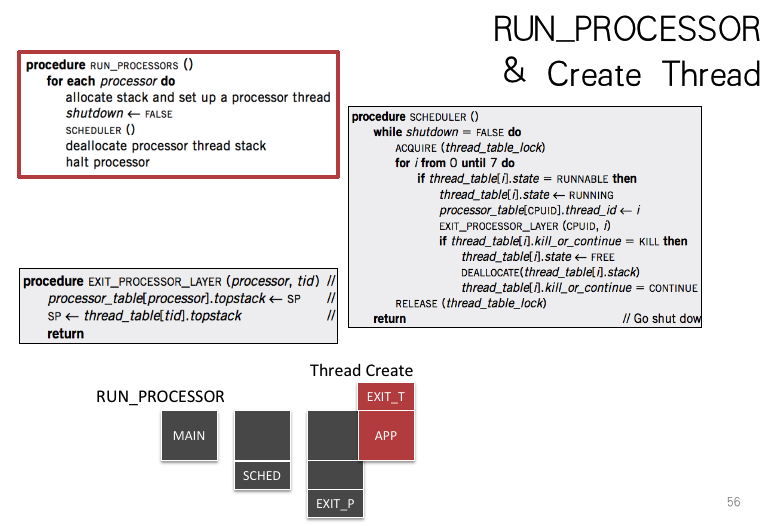

# Cse note 
## Transaction 
### CAP Theory 
* Consistency,Availability,Partition tolerance
* P通常是一个事实
* AP or CP 
* C和A并不是0或1的选择

### Abstractions of The Transaction

### All or nothing 

Atomicity 
#### Shadow copy 
* 需要在每层软件和硬件都有一个commit point，如果中途crash还是会导致非原子操作的问题
* 主要思想是only make one write to current/live copy of data
* 对多个文件或文件夹的操作难以实现；仅仅是修改一小部分也需要拷贝整个文件；一次只能执行一个操作；无法在多核或多个磁盘上work
#### Logging 
* Operations: begin / write variable/ read variable/ commit/ abort 
* Performance:
  	* `write` is probably good because sequential writes and twice writes
  	* `read` is terrible because need to scan the log for every read
  	* `recovery` is instantaneous 

##### Performance optimization 

- Add `cell storage`:

Improving `read`.`recovery` requires scanning the entire log.

Write-ahead-log protocol, this is log the update before installing it.

- Add cache for cell install:

Improving `write` and `read`.Need a redo phase in addition to an undo phase in recovery.

- Truncate the log(add checkpoint):  (一对CKPT来确定一个完整的transaction)

- External synchronous I/O:

Flush when something externally visible happens, e.g., print network sending, serial port outcome, etc.

### Before or after

In the design above, there is a problem that a write can be seen by other transactions before its COMMIT. 

Transactions provide atomicity  and isolation while not hindering performance.

Eventually, we also want transaction-based systems to be **distributed**: to run across multiple machines.

#### Serializability

- Final-state serializability
- Conflict serializability

Conflict Graph 是 **有向图** .

- View serializability

Final-state serializability $\supset$ View serializability $\supset$ Conflict serializability 

Schedules that are view serializable but not conflict serializable involve **blind writes** : 

> Blind writes: writes that are ultimately not read, which are not common in practice

Basically: conflict serializability has practical benefits.

How to generate **conflict serializability** schedules?

> Pessimistic methods: global lock, 2-phase locking
>
> Optimistic methods: OCC

#### 2PL(Two-Phase Locking)

Global lock: one transcation a time $\Rightarrow$ Simple Locking: acquire a lock for every shared data in advance and release locks only after commit or abort $\Rightarrow$ 2PL

Optimization: Read-write Locks(one write lock and multiple read locks for each variable) $\to$ `REPEATABLE READ`

Problem: 2PL can result in deadlock.

Solutions: global ordering on locks or take advantage of atomicity and abort one of the transactions.

#### OCC(Optimistic Concurrency Control)

**乐观并发控制**（又名“**乐观锁**”，Optimistic Concurrency Control，缩写“OCC”）是一种并发控制的方法。它假设多用户并发的事务在处理时不会彼此互相影响，各事务能够在不产生锁的情况下处理各自影响的那部分数据。在提交数据更新之前，每个事务会先检查在该事务读取数据后，有没有其他事务又修改了该数据。如果其他事务有更新的话，正在提交的事务会进行回滚。

T2已经commit，所以如果T1commit成功，那么，从commit的角度看T2先于T1，从最后效果的角度看T1先于T2

#### BCC(Balanced CC)

## Lock & Memory Model

### Implementing the lock

- software solution: 
  - Using load and store instructions only
  - Dekker’s & Peterson’s Algorithms
- hardware solution:
  - RSM: read-set-memory
  - TestAndSet, CompareAndSwap, LoadLinked+StoreConditional, FetchAndAdd

Peterson’s algorithms rely on atomicity of load and store, which does not hold on today’s hardware that has **relaxed memory consistency models**.

### Memory consistency models

- strict consistency
- sequential consistency
  - cache coherence is a locally consistent view. E.g., for local variable x or y, all CPUs see the same order; but for (x,y), different CPUs may see different orders.
  - sequential consistency is a globally consistent view

- processor consistency
  - Writes done by a single processor are received by all other processors in the issue order
  - But writes from different processors may be seen in a different order by different processors

### Atomic instructions

TestAndSet, CompareAndSwap, LoadLinked+StoreConditional, FetchAndAdd

### Lock performance

- coarse-grained lock
- fine-grained lock $\Rightarrow$ deadlock/livelock
  - pessimistically lock ordering
  - optimmistically backing out, setting timer expiration or cycle detection

## Thread and Condition Variable

### schedule 

When create a new thread, the stack of the thread must be initialized to include YIELD(), and push the return address to the middle of YIELD(),  so that when after return, the new thread will first release the lock, just as the previous slide. Then return again to the start_procedure (by pushing the address to the stack too).

## Distributed Transaction

### Two phase commit

- phase-1: preparation/voting
  - lower-layer transactions either aborts or tentatively committed
  - higher-layer transaction evaluates lower situation 
- phase-2: commitment
  - if top-layer, then COMMIT or ABORT
  - if nested itself, then become tentatively committed 

