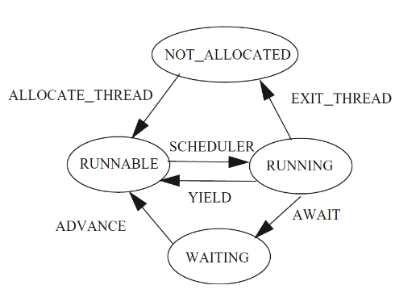
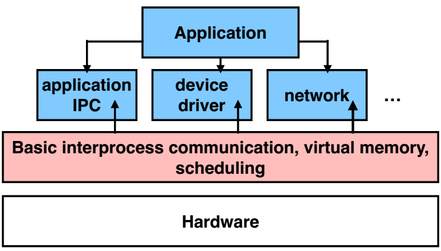

# Cse note 
## Transaction 
### CAP Theory 
* Consistency,Availability,Partition tolerance
* P通常是一个事实
* AP or CP 
* C和A并不是0或1的选择

### Abstractions of The Transaction


### All or nothing 

Atomicity 
#### Shadow copy 
* 需要在每层软件和硬件都有一个commit point，如果中途crash还是会导致非原子操作的问题
* 主要思想是only make one write to current/live copy of data
* 对多个文件或文件夹的操作难以实现；仅仅是修改一小部分也需要拷贝整个文件；一次只能执行一个操作；无法在多核或多个磁盘上work
#### Logging 
* Operations: begin / write variable/ read variable/ commit/ abort 
* Performance:
  	* `write` is probably good because sequential writes and twice writes
  	* `read` is terrible because need to scan the log for every read
  	* `recovery` is instantaneous 

##### Performance optimization 

- Add `cell storage`:

Improving `read`.`recovery` requires scanning the entire log.


Write-ahead-log protocol, this is log the update before installing it.

- Add cache for cell install:

Improving `write` and `read`.Need a redo phase in addition to an undo phase in recovery.

- Truncate the log(add checkpoint):  (一对CKPT来确定一个完整的transaction)


- External synchronous I/O:

Flush when something externally visible happens, e.g., print network sending, serial port outcome, etc.

### Before or after

In the design above, there is a problem that a write can be seen by other transactions before its COMMIT. 

Transactions provide atomicity  and isolation while not hindering performance.

Eventually, we also want transaction-based systems to be **distributed**: to run across multiple machines.

#### Serializability

- Final-state serializability
- Conflict serializability


Conflict Graph 是 **有向图** .

- View serializability


Final-state serializability $\supset$ View serializability $\supset$ Conflict serializability 

Schedules that are view serializable but not conflict serializable involve **blind writes** : 

> Blind writes: writes that are ultimately not read, which are not common in practice

Basically: conflict serializability has practical benefits.

How to generate **conflict serializability** schedules?

> Pessimistic methods: global lock, 2-phase locking
>
> Optimistic methods: OCC

#### 2PL(Two-Phase Locking)

Global lock: one transcation a time $\Rightarrow$ Simple Locking: acquire a lock for every shared data in advance and release locks only after commit or abort $\Rightarrow$ 2PL


Optimization: Read-write Locks(one write lock and multiple read locks for each variable) $\to$ `REPEATABLE READ`

Problem: 2PL can result in deadlock.

Solutions: global ordering on locks or take advantage of atomicity and abort one of the transactions.

#### OCC(Optimistic Concurrency Control)

**乐观并发控制**（又名“**乐观锁**”，Optimistic Concurrency Control，缩写“OCC”）是一种并发控制的方法。它假设多用户并发的事务在处理时不会彼此互相影响，各事务能够在不产生锁的情况下处理各自影响的那部分数据。在提交数据更新之前，每个事务会先检查在该事务读取数据后，有没有其他事务又修改了该数据。如果其他事务有更新的话，正在提交的事务会进行回滚。


T2已经commit，所以如果T1commit成功，那么，从commit的角度看T2先于T1，从最后效果的角度看T1先于T2

#### BCC(Balanced CC)


## Lock & Memory Model

### Implementing the lock

- software solution: 
  - Using load and store instructions only
  - Dekker’s & Peterson’s Algorithms
- hardware solution:
  - RSM: read-set-memory
  - TestAndSet, CompareAndSwap, LoadLinked+StoreConditional, FetchAndAdd

Peterson’s algorithms rely on atomicity of load and store, which does not hold on today’s hardware that has **relaxed memory consistency models**.

### Memory consistency models

- strict consistency ( A read gets the latest write value )
- sequential consistency
  - Sequential consistency is **weaker** than strict consistency. Allow "memory write lag". But require write propagate at the same time
  - cache coherence is a locally consistent view. E.g., for local variable x or y, all CPUs see the same order; but for (x,y), different CPUs may see different orders.
  - sequential consistency is a globally consistent view


- processor consistency ( consider the network latency )
  - Writes done by a single processor are received by all other processors in the issue order
  - But writes from different processors may be seen in a different order by different processors


### Atomic instructions

- TestAndSet

```c
1 int TestAndSet(int *old_ptr, int new) {
2     int old = *old_ptr; // fetch old value at old_ptr
3     *old_ptr = new; // store 'new' into old_ptr
4     return old; // return the old value
5 }
```


- CompareAndSwap

```c
1 int CompareAndSwap(int *ptr, int expected, int new) {
2     int actual = *ptr;
3     if (actual == expected)
4         *ptr = new;
5     return actual;
6 }

```


- LoadLinked+StoreConditional

```c
1 int LoadLinked(int *ptr) {
2     return *ptr;
3 }
4
5 int StoreConditional(int *ptr, int value) {
6     if (no one has updated *ptr since the LoadLinked to this address) { 
7         *ptr = value;
8         return 1; // success!
9     } else {
10         return 0; // failed to update
11    }
12 }

```


- FetchAndAdd

```c
1 int FetchAndAdd(int *ptr) {
2     int old = *ptr;
3     *ptr = old + 1;
4     return old;
5 }

```


### Lock performance

- coarse-grained lock
- fine-grained lock $\Rightarrow$ deadlock/livelock
  - pessimistically lock ordering
  - optimmistically backing out, setting timer expiration or cycle detection

### Methods for Solving Deadlock

- **Lock ordering (pessimistic)**
  - Number the locks uniquely
  - Require transactions acquire locks in order
  - Problem: some app may not predict all of the locks they need before acquiring the first one
- **Backing out (optimistic)**
  - Allow acquire locks in any order
  - If it encounters an already-acquired lock with an number lower than one it has previously acquired itself, then
    - UNDO: Back up to release its higher-numbered locks
    - Wait for the lower-numbered lock and REDO
- **Timer expiration (optimistic)**
  - Set a timer at begin_transaction, abort if timeout
  - If still no progress, another one may abort
  - Problem: how to chose the interval?
- **Cycle detection (optimistic)**
  - Maintain a wait-for-graph in the lock manager
    - Shows owner and waiting ones
    - Check when transaction tries to acquire a lock
  - Prevent cycle (deadlock)
    - Select some cycle member to be a victim 

Livelock & Deadlock ( refer to 阿月 )

Livelock：整天不做正事，导致正事永远做不完
Deadlock：“你先把枪放下！”“你放我就放！”“你放我才放！”（无限套娃

## Thread and Condition Variable


### yield


### wait() & notify()

wait()会调yield()

Problem: one process receives notify() before falls in wait()

Solution: 

- New API: (将release、wait、acquire做成一个原子操作)
  WAIT(cv, lock): release lock, yield CPU, wait to be notified（改调yield_wait()）
  NOTIFY(cv): notify waiting threads of cv

### yield_wait()

> With Preemptive Scheduling


### schedule (Code In Book)

#### Thread Layer and Processor Layer

- A thread runs in thread layer
- A thread calls YIELD, enters processor layer
- Saves the state of the running thread
  - General purpose regs + PC + SP + CR3
- Chose another runnable thread
- Exit the processor layer and enter thread layer
- The new thread runs in thread layer


When create a new thread, the stack of the thread must be initialized to include YIELD(), and push the return address to the middle of YIELD(),  so that when after return, the new thread will first release the lock, just as the previous slide. Then return again to the start_procedure (by pushing the address to the stack too).

### Thread State Diagram



## Distributed Transaction

### Two phase commit

> Nodes agree that they are ready to commit before committing.

- phase-1: preparation/voting
  - lower-layer transactions either aborts or tentatively committed
  - higher-layer transaction evaluates lower situation 
- phase-2: commitment
  - if top-layer, then COMMIT or ABORT
  - if nested itself, then become tentatively committed 

### Failures happened at server or coordinator

#### Worker(Server) Failure During Commit 

- If workers fail after the commit point
  - We cannot abort the transaction
  - Workers must be able to recover into a prepared state 
  - Workers write PREPARE records to log once prepared \
- The recovery process will:
  - Read through the log, and
  - Indicate which transactions are prepared but not committed 

### Optimistic Replication

- Use of Time in Computer Systems
  - Synchronizing a clock over the internet: **NTP**. Query server's time, adjust local time accordingly
  - What if a computer's clock is too fast?
    - Idea: temporarily slow down or speed up the clock
    - Typically cannot adjust oscillator (fixed hardware)
    - Adjust oscillator frequency estimate, so counter advances faster / slower
  - File Reconciliation with Timestamps ( Goal: No Lost Updates )
- Vector Timestamps
  - Store a vector of timestamps from each machine
  - Entry in vector keeps track of the last mtime
  - V1 is newer than V2 if all of V1's timestamps are >= V2’s
  - V1 is older than V2 if all of V1's timestamps are <= V2’s
  - Otherwise, V1 and V2 were modified concurrently, so conflict

### Pessimistic replication ( RSM & Paxos )

#### Handling Network Partitions

Idea: require a majority servers to perform 

#### Quorum ( 分布式系统 )

- Define separate read &write quorums: Qr & Qw
  - Qr + Qw > Nreplicas  (Why?)
    - Confirm a write after writing to at least Qw of replicas
    - Read at least Qr agree on the data or witness value
- Example
  - In favor of reading: Nreplicas = 5, Qw = 4, Qr = 2
  - In favor or updating: Nreplicas = 5, Qw = 2, Qr = 4
  - Enhance availability by Qw = Nreplicas & Qr = 1

#### RSM ( Replicated State Machines )

- A general approach to making consistent replicas of a server:

  - Start with the **same initial state** on each server
  - Provide each replica with the **same input** operations, in same order
  - Ensure all operations are **deterministic**
    - E.g., no randomness, no reading of current time, etc.

- These rules ensure each server will end up in the **same final state** 

- RSMs use a **primary-backup** mechanism for replication

  - Using view server ensures that only one replica acts as the primary
  - It can also recruit new backups after servers fail
  - Primary很重要，决定order和一些不确定的值，相当于是leader
  - Primary的操作需要backup的ACK

- ADD **View-Server** 

  - The view server keeps a table that maintains a sequence of "view"
  - 同时指定谁是primary 和 backup，并告知client，但是它并不转发请求，还是由client发请求
  - before S2( a backup server before ) knows it's primary, it will reject any requests from clients 

- A few rules
  1. Primary must wait for backup to accept each request    
  2. Non-primary must reject direct coordinator requests
  (That's what happened in the earlier failure, in the interim between the failure and S2 hearing that it was primary)
  3. Primary must reject forwarded requests
  (I.e., it won't accept an update from the backup)

  4. Primary in view i must have been primary or backup in view i-1   

#### Paxos

**Client** : makes a request.

**Proposer** : Get a request and run the protocol. Leader = elected Coordinator.

**Acceptor** : Remember the state of the protocol. Quorum = any majority of Acceptors.

**Learner** : When agreement has been reached, a Learner executes the request and/or sends a response back to the Client.

- To make a change to the system
  - Tell the proposer(leader) the event
    	(NOTE: these requests may occur concurrently)	
  - The leader picks its next highest ID and asks proposal to all the acceptors with that ID
  - When the majority of acceptors accept the proposal, accepted event are sent to learners 
  - The learners do event (e.g., update system state)

#### The CAP Theorem

It is impossible for a distributed computer system to simultaneously provide all three of the following guarantees

- Consistency (all nodes see the same data at the same time)
- Availability (a guarantee that every request receives a response about whether it succeeded or failed)
- Partition tolerance (the system continues to operate despite arbitrary message loss or failure of part of the system)


### P2P Network

> No Central Servers!

#### BitTorrent

- Usage Model: Cooperative
  - User downloads file from someone using simple user interface
  - While downloading, BitTorrent serves file also to others
  - BitTorrent keeps running for a little while after download completes
- 3 Roles
  - Tracker: What peer serves which parts of a file ( It is a central component. )
  - Seeder: Own the whole file
  - Peer: Turn a seeder once has 100% of a file
- DHT ( Distributed hash table )
  - Interface: Provide an abstract interface to store and find data
  
  - Typical DHT interface:
    put(key, value)
    get(key) -> value
    Loose guarantees about keeping data alive
    
  - Failures might cause incorrect lookup? ：
    
    Solution: successor lists. ( Successor List Length. Assume 1/2 of nodes fail. )
  
  

### I/O Latency

- With IDE bus: The electronics would be the bottleneck at 66 MB/S
- With SATA-3 bus: The mechanics would be the bottleneck at 180 MB/S


## Secure

### TLS handshake


### Microkernel



- Pros
  - Easier to develop services
  - Fault isolation
  - Customization
  - Smaller kernel => easier to optimize
- Cons
  - Lots of boundary crossings
  - Relatively poor performance

## Virtualization

### CPU virtualization

> Enable each guest VM has its own kernel and user modes
> Keep isolation between guest's kernel and user modes

#### Problems of Trap & Emulate

- Not all architectures are "strictly virtualizable" (X86)
- An ISA is strictly virtualizable if, when executed in a lesser privileged mode:
  - All instructions that access privileged state trap
  - All instructions either trap or execute identically
- Trap costs may be high

#### There 17 such instructions in X86 ( behavior diff between user and kernel mode)

SGDT, SIDT, SLDT, SMSW, PUSHF, POPF, LAR, LSL, VERR, VERW, POP, PUSH, CALL, JMP, INT n, RET, STR, MOV 

#### How to Deal with the 17 Instructions?

- Instruction Interpretation: emulate them by software
  - Emulate Fetch/Decode/Execute pipeline in software ( Very slow! )
- Binary translation: translate them to other instructions
  - Translate before execution ( E.g., VMware, Qemu )
- Para-virtualization: replace them in the source code
  - Modify OS and let it cooperate with the VMM ( E.g., Xen hypervisor )
- New hardware: change the CPU


### Memory virtualization

> Enable each guest VM has its own virtual MMU
> Keep isolation between guest VMs


#### shadow Paging


- What if a Guest OS Modifies its Own Page Table?
  - Solution :
    VMM need to intercept when guest OS modifies page table, and update the shadow page table accordingly
    Mark the guest table pages as read-only (in the shadow page table)
    If guest OS tries to modify its page tables, it triggers page fault
    VMM handles the page fault by updating shadow page table
- What if a Guest App Access its Kernel Memory?
  - One solution: split a shadow page table to two tables
    Two shadow page tables, one for user, one for kernel
    When guest OS switches to user mode, VMM will switch the shadow page table as well, vice versa
    Recall trap & emulate

#### Direct Paging (Para-virtualization)

- Modify the guest OS
  - No GPA is needed, just GVA and HPA
  - Guest OS directly manages its HPA space
  - Use hypercall to let the VMM update the page table
  - The hardware CR3 will point to guest page table
- VMM will check all the page table operations
  - The guest page tables are read-only to the guest

#### Hardware Supported Memory Virtualization

Another table

- EPT for translation from GPA to HPA
  EPT is controlled by the hypervisor
  EPT is per-VM


### I/O virtualization

> Enable each guest VM has its own virtual devices

- I/O virtualization
  - Sol-1: Device emulation
  - Sol-2: Para-virtualization driver, e.g., virtio
  - Sol-3: Hardware support, e.g., SR-IOV